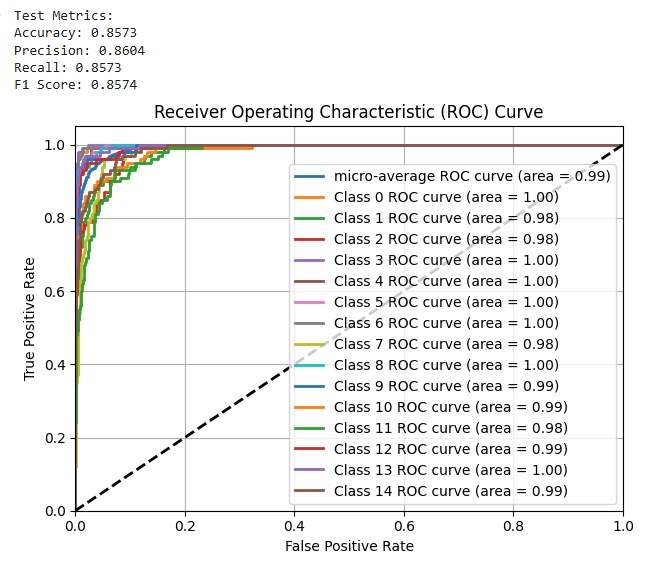

# CAS 771 Group 11 Project

This is an image classifier project. This project uses two datasets named Task A and Task B in  the project repository.
Each of the dataset has three submodels that contain cifar100 image data for 5 classes of objects, including animal, plants etc.
The TaskB dataset has data with overlapped classes between submodels. Therefore, we also conducted a fusion model to pursue a better performance.

## Repository Structure
```
root/
├── Model1               # Model 1 data for Task A
│   ├── model1_test.pth  # Test data
│   └── model1_train.pth # Training data
├── Model2               # Model 2 data for Task A
│   └── ...              # (same as model1)
├── Model3               # Model 2 data for Task A
│   └── ...              # (same as model1)
├── Models               # Trained models for Task A
├── TaskB                # Dataset for Task B
│   ├── Model1           # Model 1 training and testing data (too large to upload all)
│   └── Models           # Training models for Task B
├── evaluation           # Evaluation functions for different models
├── cifar100_classes     # Collection of classes names of CIFAR-100 data
├── main.py              # Main function for non-fused model approach for both tasks
├── model_fusion.py      # Fused model approach for Task A
├── model_fusion_task2.py  # Fused model approach for Task B
├── evaluation_all.ipynb # Evaluation script, shows result directly
├── final report.pdf     # Final report essay
└── requirements.txt     # Dependency requirements
```

## Required Libraries

We made a jupyter notebook that can smoothly run on Google Colab to show the result.

```bash
!pip install torch torchvision torchsummary numpy matplotlib
```

## Evaluation Notebook

We have a jupyter notebook that can smoothly run on Google Colab to show the result.

```bash
jupyter evaluation_all.ipynb
```
You can directly open it on Google Colab and select "run all cells". All the required data and models have been compressed and stored
on Google drive. The notebook will automatically download and import the data. It will load each trained model and test
on datasets according.

### Evaluation Structure

Here  is the list of all primary cells in our notebook. We made four evaluations on our four trained models. 


Firstly, we did two evaluations on Task A and B by using six separate models for Task A and Task B, each model 
is trained for each sub dataset under Task A and B.<br />
Then we conducted two fusion models for Task A and B data. Each fusion model was trained by combining the features
from all the submodels of Task A and B.<br />

### Read the data
After you run the cells, the corresponding data will display inside each cell.



The first part of output data is about the numbers. It displays accuracy rate, precision rate, recall rate 
and f1 score of the whole task dataset. There is an additional graph shows True Positive Rate (TPR) and 
False Positive Rate (FPR).


And each evaluation will display 10 randomly selected images, show the true class of the object
and the prediction from the model.

### Final Report
Check out "**final report.pdf**" file to see our essay.